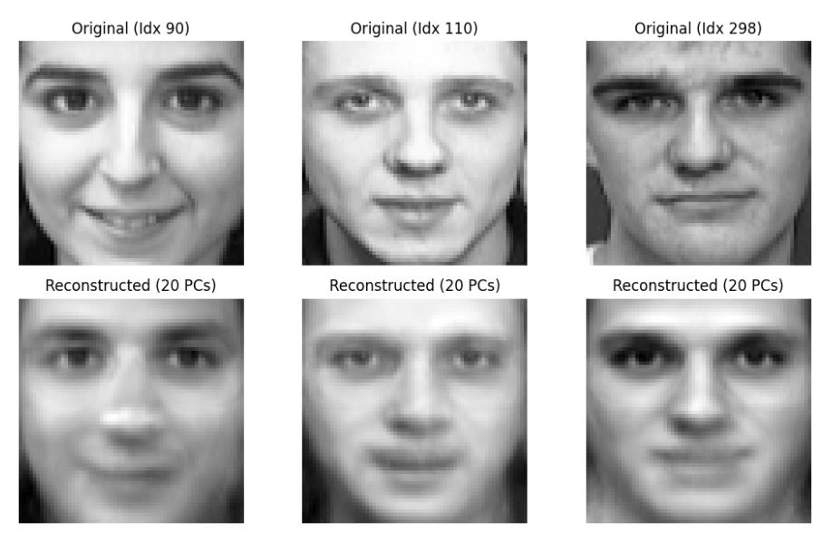

# 👤 PCA Face Reconstruction  

Dimensionality reduction and feature extraction using Principal Component Analysis (PCA) on the **Olivetti Faces** dataset. This project explores how to compress high-dimensional facial data while maintaining structural integrity.
### 🖥️ Reconstruction Results

## 🛠️ Tech Stack  
- **Python** (NumPy, Scikit-learn, Matplotlib)
- **Kaggle** (Environment)

## 🚀 Key Highlights  
- **Data Compression:** Reduced 4,096 pixels to just 40 principal components.
- **Accuracy:** Retained 90%+ variance of the original data.
- **Visual Analysis:** Visualized "Eigenfaces" to map key facial features like eyes, nose, and lighting.
- **Performance:** Improved SSIM (Structural Similarity Index) from 0.71 to 0.74 by optimizing component selection.

## 📊 Results  
The model successfully reconstructed facial images with minimal error (RMSE: 0.0512), proving that PCA is highly effective for efficient image processing.

## 🔗 View Notebook
[Link to Kaggle Notebook](https://www.kaggle.com/code/mdzunaidtausif/homework-1))
